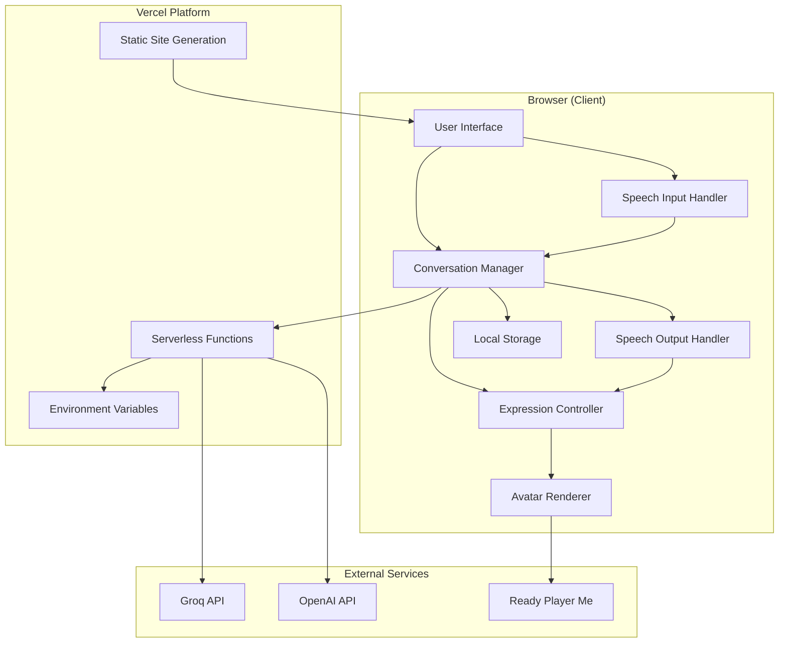

# Design Document: AI Avatar System

## Overview

The AI Avatar System is a browser-based conversational interface that combines visual avatar representation with natural language processing to create engaging user interactions. The system is architected for cost-efficiency, leveraging browser APIs (Web Speech API), free-tier LLM services (Groq), and Vercel's serverless platform to minimize operational costs while maintaining responsive performance.

The architecture follows a client-heavy approach where most processing occurs in the browser, with serverless functions acting as secure API proxies. This design minimizes server costs while maintaining security for API credentials.

### Key Design Principles

1. **Cost Optimization**: Maximize use of free browser APIs and free-tier services
2. **Security First**: Never expose API keys to client-side code
3. **Graceful Degradation**: Provide fallbacks when features are unavailable
4. **Performance**: Target sub-3-second response times for natural conversation flow
5. **Accessibility**: Support multiple interaction modes (speech, text, keyboard)

## Architecture

### System Architecture Diagram



### Component Interaction Flow

1. **User Input Flow**:
   - User speaks or types → Speech Input Handler or UI
   - Input converted to text → Conversation Manager
   - Request sent to API Proxy → Serverless Function
   - LLM processes request → Response returned
   - Response displayed and spoken → UI and Speech Output Handler

2. **Expression Synchronization Flow**:
   - System state changes → Expression Controller notified
   - Expression Controller updates avatar state → Avatar Renderer
   - Avatar Renderer applies animation → Visual update

3. **Session Persistence Flow**:
   - Conversation occurs → Conversation Manager updates context
   - Context saved → Local Storage
   - User returns → Context restored from Local Storage

## Components and Interfaces

### 1. Avatar Renderer

**Responsibility**: Display and animate the visual avatar representation

**Technology Options**:
- **Option A**: Ready Player Me (3D avatars, WebGL-based)
- **Option B**: Custom 2D sprite-based system (lower resource usage)

**Interface**:
```typescript
interface AvatarRenderer {
  // Initialize the avatar with configuration
  initialize(config: AvatarConfig): Promise<void>;
  
  // Update the current expression
  setExpression(expression: Expression): void;
  
  // Get current rendering state
  getState(): AvatarState;
  
  // Clean up resources
  dispose(): void;
}

type Expression = 'neutral' | 'happy' | 'thinking' | 'speaking' | 'listening';

interface AvatarConfig {
  avatarUrl?: string;  // Ready Player Me URL or sprite sheet URL
  renderMode: '2d' | '3d';
  animationSpeed: number;
}

interface AvatarState {
  isLoaded: boolean;
  currentExpression: Expression;
  fps: number;
}
```

**Implementation Notes**:
- Use Three.js for 3D rendering if Ready Player Me is selected
- Implement sprite animation system for 2D mode
- Target 24+ FPS for smooth animations
- Implement expression transition interpolation (300ms)

### 2. Conversation Manager

**Responsibility**: Orchestrate LLM interactions and maintain conversation context

**Interface**:
```typescript
interface ConversationManager {
  // Initialize with use case configuration
  initialize(useCase: UseCase): Promise<void>;
  
  // Send a message and get response
  sendMessage(message: string): Promise<ConversationResponse>;
  
  // Get conversation history
  getHistory(): Message[];
  
  // Clear conversation and start fresh
  reset(): void;
  
  // Save/restore session
  saveSession(): void;
  restoreSession(): Promise<boolean>;
}

interface Message {
  id: string;
  role: 'user' | 'assistant' | 'system';
  content: string;
  timestamp: number;
}

interface ConversationResponse {
  message: string;
  conversationId: string;
  tokensUsed: number;
}

type UseCase = 'support' | 'sales' | 'education' | 'healthcare';
```

**Implementation Notes**:
- Maintain rolling context window (last 10 exchanges)
- Implement exponential backoff for rate limiting
- Store conversation history in Local Storage
- Include system prompts tailored to use case

### 3. Speech Input Handler

**Responsibility**: Capture and convert user speech to text

**Interface**:
```typescript
interface SpeechInputHandler {
  // Check if speech recognition is available
  isSupported(): boolean;
  
  // Start listening for speech
  startListening(): void;
  
  // Stop listening
  stopListening(): void;
  
  // Get current listening state
  isListening(): boolean;
  
  // Event handlers
  onSpeechDetected(callback: (text: string) => void): void;
  onError(callback: (error: SpeechError) => void): void;
}

interface SpeechError {
  code: string;
  message: string;
}
```

**Implementation Notes**:
- Use Web Speech API (SpeechRecognition)
- Implement visual feedback during listening
- Handle browser compatibility gracefully
- Provide clear error messages for unsupported browsers

### 4. Speech Output Handler

**Responsibility**: Convert AI responses to speech

**Interface**:
```typescript
interface SpeechOutputHandler {
  // Check if text-to-speech is available
  isSupported(): boolean;
  
  // Speak the provided text
  speak(text: string): Promise<void>;
  
  // Control playback
  pause(): void;
  resume(): void;
  stop(): void;
  
  // Get current state
  isSpeaking(): boolean;
  
  // Event handlers
  onSpeechStart(callback: () => void): void;
  onSpeechEnd(callback: () => void): void;
  onError(callback: (error: SpeechError) => void): void;
}
```

**Implementation Notes**:
- Primary: Web Speech API (SpeechSynthesis)
- Fallback: OpenAI TTS API (if configured and Web Speech fails)
- Implement playback controls (pause, resume, stop)
- Synchronize with Expression Controller

### 5. Expression Controller

**Responsibility**: Manage avatar facial expressions based on system state

**Interface**:
```typescript
interface ExpressionController {
  // Set expression based on system state
  setStateExpression(state: SystemState): void;
  
  // Manually set expression
  setExpression(expression: Expression): void;
  
  // Get current expression
  getCurrentExpression(): Expression;
}

type SystemState = 'idle' | 'listening' | 'thinking' | 'speaking';
```

**Implementation Notes**:
- Map system states to expressions
- Implement smooth transitions (300ms)
- Handle expression priority (speaking > listening > thinking > idle)
- Reset to neutral after 3 seconds of inactivity

### 6. API Proxy (Serverless Functions)

**Responsibility**: Securely proxy requests to external services

**Endpoints**:

```typescript
// POST /api/chat
interface ChatRequest {
  message: string;
  conversationId: string;
  history: Message[];
  useCase: UseCase;
}

interface ChatResponse {
  message: string;
  conversationId: string;
  tokensUsed: number;
}

// POST /api/tts (fallback only)
interface TTSRequest {
  text: string;
  voice?: string;
}

interface TTSResponse {
  audioUrl: string;
}

// GET /api/health
interface HealthResponse {
  status: 'ok' | 'degraded';
  services: {
    groq: boolean;
    openai: boolean;
  };
}
```

**Implementation Notes**:
- Validate request origins
- Implement rate limiting per IP/session
- Use environment variables for API keys
- Return appropriate error codes (401, 429, 500)
- Log usage metrics for cost monitoring

## Data Models

### Session Data

```typescript
interface Session {
  id: string;
  createdAt: number;
  lastAccessedAt: number;
  useCase: UseCase;
  conversationHistory: Message[];
  metadata: {
    totalMessages: number;
    totalTokens: number;
  };
}
```

**Storage**: Browser Local Storage
**Retention**: 24 hours
**Size Limit**: ~5MB (Local Storage limit)

### Configuration Data

```typescript
interface SystemConfig {
  // LLM Configuration
  llm: {
    provider: 'groq' | 'openai';
    model: string;
    maxTokens: number;
    temperature: number;
  };
  
  // Avatar Configuration
  avatar: {
    renderMode: '2d' | '3d';
    avatarUrl?: string;
    expressions: Record<Expression, string>;
  };
  
  // Use Case Configuration
  useCase: {
    type: UseCase;
    systemPrompt: string;
    personality: string;
  };
  
  // Feature Flags
  features: {
    speechInput: boolean;
    speechOutput: boolean;
    fallbackTTS: boolean;
  };
  
  // Rate Limiting
  rateLimits: {
    maxMessagesPerMinute: number;
    maxTokensPerDay: number;
  };
}
```

**Storage**: Environment variables + runtime configuration
**Access**: Server-side only (except feature flags)

### Message Data

```typescript
interface Message {
  id: string;
  role: 'user' | 'assistant' | 'system';
  content: string;
  timestamp: number;
  metadata?: {
    tokensUsed?: number;
    processingTime?: number;
    error?: string;
  };
}
```

**Storage**: Session object in Local Storage
**Lifecycle**: Persists for session duration (24 hours)


## Correctness Properties

*A property is a characteristic or behavior that should hold true across all valid executions of a system—essentially, a formal statement about what the system should do. Properties serve as the bridge between human-readable specifications and machine-verifiable correctness guarantees.*

### Property 1: Expression Support Completeness

*For any* expression in the required set {neutral, happy, thinking, speaking, listening}, calling `setExpression()` with that expression should result in the avatar displaying that expression.

**Validates: Requirements 1.2**

### Property 2: Responsive Avatar Scaling

*For any* viewport width between 320px and 2560px, the avatar renderer should scale appropriately without overflow, distortion, or layout breaking.

**Validates: Requirements 1.5**

### Property 3: Conversation History Maintenance

*For any* sequence of messages in a session, if the total message count is 10 or fewer, then all messages should be retained in the conversation history; if the count exceeds 10, then the most recent 10 exchanges should be retained.

**Validates: Requirements 2.2, 2.5**

### Property 4: Speech Input Visual Feedback

*For any* time period when the Speech Input Handler is in listening state, the UI should display the active listening indicator.

**Validates: Requirements 3.3**

### Property 5: Speech to Text Conversion

*For any* speech input detected by the Speech Input Handler, the converted text should be passed to the Conversation Manager.

**Validates: Requirements 3.4**

### Property 6: Text to Speech Invocation

*For any* text response received from the LLM service, the Speech Output Handler should be invoked to convert it to speech (unless speech is disabled).

**Validates: Requirements 4.2**

### Property 7: Expression State Synchronization

*For any* system state (listening, thinking, speaking, idle), the Expression Controller should display the corresponding expression: listening → listening, thinking → thinking, speaking → speaking, idle → neutral.

**Validates: Requirements 4.3, 5.1, 5.2**

### Property 8: Speech Playback Control

*For any* active speech playback, calling pause() should pause the audio, calling resume() should continue from the paused position, and calling stop() should terminate playback completely.

**Validates: Requirements 4.4**

### Property 9: API Key Non-Exposure

*For any* API response sent to the client, the response body, headers, and error messages should not contain API keys or credentials.

**Validates: Requirements 6.2**

### Property 10: Request Origin Validation

*For any* request to the API proxy with an invalid or unauthorized origin, the request should be rejected with an appropriate error code.

**Validates: Requirements 6.4**

### Property 11: Rate Limit Enforcement

*For any* sequence of requests exceeding the configured rate limit within the time window, subsequent requests should be throttled, queued, or rejected until the limit resets.

**Validates: Requirements 7.3**

### Property 12: Use Case System Prompt Mapping

*For any* supported use case (support, sales, education, healthcare), when that use case is configured, the system prompt should match the prompt defined for that use case.

**Validates: Requirements 7.5**

### Property 13: Client-Side Cache Utilization

*For any* API request with identical parameters made within the cache validity period, the second request should return cached data without making a network call.

**Validates: Requirements 9.5**

### Property 14: Session Persistence Round-Trip

*For any* session data saved to local storage, restoring the session should produce equivalent conversation history, metadata, and configuration.

**Validates: Requirements 10.2, 10.5**

### Property 15: Use Case Configuration Loading

*For any* supported use case selected at runtime, the system should load the corresponding configuration profile including system prompt, personality settings, and avatar customization.

**Validates: Requirements 11.1, 11.5**

### Property 16: Error Logging Completeness

*For any* error that occurs in any component, an error entry should be logged to the console with sufficient detail for debugging.

**Validates: Requirements 12.5**

### Property 17: Keyboard Navigation Completeness

*For any* interactive element in the UI, it should be reachable and operable using only keyboard navigation (Tab, Enter, Space, Arrow keys).

**Validates: Requirements 13.1**

### Property 18: ARIA Label Presence

*For any* interactive element in the UI, it should have an appropriate ARIA label, role, or description for screen reader compatibility.

**Validates: Requirements 13.2**

### Property 19: Color Contrast Compliance

*For any* text element in the UI, the contrast ratio between text and background should meet or exceed WCAG AA standards (4.5:1 for normal text, 3:1 for large text).

**Validates: Requirements 13.4**

### Property 20: API Usage Tracking Accuracy

*For any* session with N API calls made, the usage tracking metrics should accurately reflect N calls with corresponding token counts and timestamps.

**Validates: Requirements 14.1, 14.3**

### Property 21: Usage Cap Enforcement

*For any* usage that reaches or exceeds the configured daily or monthly cap, subsequent API requests should be rejected until the cap resets.

**Validates: Requirements 14.4**

## Error Handling

### Error Categories

1. **Network Errors**: Failed API calls, timeout, connection issues
2. **Service Errors**: LLM service unavailable, rate limits exceeded
3. **Browser API Errors**: Speech API not supported or failed
4. **Rendering Errors**: Avatar failed to load, animation errors
5. **Data Errors**: Invalid session data, corrupted local storage

### Error Handling Strategy

```typescript
interface ErrorHandler {
  handleError(error: SystemError): ErrorResponse;
}

interface SystemError {
  category: ErrorCategory;
  code: string;
  message: string;
  component: string;
  recoverable: boolean;
}

interface ErrorResponse {
  userMessage: string;
  fallbackAction?: () => void;
  retryable: boolean;
  logDetails: Record<string, any>;
}

type ErrorCategory = 'network' | 'service' | 'browser' | 'rendering' | 'data';
```

### Specific Error Handling Rules

1. **LLM Service Unavailable** (12.1):
   - Display: "The AI service is temporarily unavailable. Please try again in a moment."
   - Action: Provide retry button
   - Fallback: None (core functionality)

2. **Speech Input Failure** (12.2):
   - Display: "Voice input is unavailable. Switching to text mode."
   - Action: Automatically enable text input field
   - Fallback: Text-only mode

3. **Speech Output Failure** (12.3):
   - Display: Response text in chat interface
   - Action: Disable speech toggle, show text
   - Fallback: Text-only output

4. **Avatar Renderer Failure** (12.4):
   - Display: Static avatar image or placeholder
   - Action: Continue with text/speech functionality
   - Fallback: Headless mode (no avatar)

5. **Rate Limit Exceeded** (7.4):
   - Display: "Please wait a moment before sending another message."
   - Action: Queue request or show countdown timer
   - Fallback: None (enforce limit)

6. **Session Restore Failure**:
   - Display: "Starting a fresh conversation."
   - Action: Create new session
   - Fallback: Clear corrupted data

7. **Authentication Failure** (6.5):
   - Display: "Unable to authenticate request."
   - Action: Return 401 status code
   - Fallback: None (security requirement)

### Error Logging

All errors must be logged with:
- Timestamp
- Component name
- Error category and code
- User-facing message
- Technical details (stack trace, request data)
- User session ID (for debugging)

```typescript
function logError(error: SystemError, context: Record<string, any>): void {
  console.error({
    timestamp: Date.now(),
    component: error.component,
    category: error.category,
    code: error.code,
    message: error.message,
    recoverable: error.recoverable,
    context,
    sessionId: getCurrentSessionId(),
  });
}
```

## Testing Strategy

### Dual Testing Approach

The AI Avatar System requires both unit testing and property-based testing for comprehensive coverage:

- **Unit tests**: Verify specific examples, edge cases, error conditions, and integration points
- **Property tests**: Verify universal properties across all inputs through randomization

Unit tests are helpful for concrete scenarios and edge cases, but we should avoid writing too many—property-based tests handle covering lots of inputs. Unit tests should focus on specific examples that demonstrate correct behavior, integration points between components, and edge cases. Property tests should focus on universal properties that hold for all inputs with comprehensive input coverage through randomization.

### Property-Based Testing Configuration

**Library Selection**:
- **JavaScript/TypeScript**: Use `fast-check` library
- Minimum 100 iterations per property test (due to randomization)
- Each property test must reference its design document property
- Tag format: `// Feature: ai-avatar-system, Property {number}: {property_text}`

**Example Property Test Structure**:

```typescript
import fc from 'fast-check';

// Feature: ai-avatar-system, Property 1: Expression Support Completeness
describe('Avatar Expression Support', () => {
  it('should display any required expression when set', () => {
    fc.assert(
      fc.property(
        fc.constantFrom('neutral', 'happy', 'thinking', 'speaking', 'listening'),
        (expression) => {
          const renderer = new AvatarRenderer();
          renderer.setExpression(expression);
          expect(renderer.getCurrentExpression()).toBe(expression);
        }
      ),
      { numRuns: 100 }
    );
  });
});

// Feature: ai-avatar-system, Property 3: Conversation History Maintenance
describe('Conversation History', () => {
  it('should maintain all messages up to limit of 10 exchanges', () => {
    fc.assert(
      fc.property(
        fc.array(fc.record({
          role: fc.constantFrom('user', 'assistant'),
          content: fc.string({ minLength: 1, maxLength: 200 }),
        }), { minLength: 1, maxLength: 20 }),
        (messages) => {
          const manager = new ConversationManager();
          messages.forEach(msg => manager.addMessage(msg));
          
          const history = manager.getHistory();
          const expectedLength = Math.min(messages.length, 10);
          
          expect(history.length).toBe(expectedLength);
          
          // Should contain the most recent messages
          const expectedMessages = messages.slice(-expectedLength);
          expect(history).toEqual(expectedMessages);
        }
      ),
      { numRuns: 100 }
    );
  });
});
```

### Unit Testing Focus Areas

1. **Component Initialization**:
   - Avatar loads within 3 seconds (1.3)
   - Session creation on first access (10.1)
   - Speech API not supported message (3.5)

2. **Error Handling Examples**:
   - LLM service unavailable (12.1)
   - Speech input failure fallback (12.2)
   - Speech output failure fallback (12.3)
   - Avatar renderer failure fallback (12.4)
   - Authentication failure returns 401 (6.5)

3. **Timeout and Performance**:
   - Loading indicators after 1 second (8.4)
   - Timeout message after 10 seconds (8.5)
   - Expression reset after 3 seconds idle (5.4)

4. **Fallback Behavior**:
   - OpenAI TTS fallback when Web Speech fails (4.5)
   - OpenAI API fallback when Groq unavailable (7.2)
   - Rate limit queue/wait message (7.4)

5. **User Interactions**:
   - Microphone button starts listening (3.2)
   - Session preserved for 24 hours (10.4)
   - Text-only mode availability (13.3)
   - Animation disable functionality (13.5)
   - Usage cap message display (14.5)

### Integration Testing

Test the complete flow:
1. User speaks → Speech captured → Text extracted → LLM called → Response received → Speech played → Expression updated
2. Session save → Browser close → Browser reopen → Session restore
3. Rate limit reached → Request queued → Limit reset → Request processed
4. Primary service fails → Fallback service used → Response delivered

### Accessibility Testing

- Keyboard navigation through all interactive elements (13.1)
- Screen reader compatibility with ARIA labels (13.2)
- Color contrast validation (13.4)
- Animation disable functionality (13.5)

### Performance Testing

While not property-testable, these should be validated:
- Avatar load time < 3 seconds (1.3)
- Message send latency < 100ms (2.1)
- Response display latency < 200ms (2.4)
- Speech processing < 500ms (8.2)
- Audio playback start < 500ms (8.3)
- Overall response time < 3 seconds (8.1)

### Cost Monitoring Tests

- API call counting accuracy (14.1)
- Usage metrics logging (14.3)
- Rate limit enforcement (7.3, 14.2)
- Usage cap enforcement (14.4)

### Test Environment Setup

```typescript
// Mock LLM service for testing
class MockLLMService {
  async chat(message: string): Promise<string> {
    return `Mock response to: ${message}`;
  }
}

// Mock Speech API
class MockSpeechRecognition {
  start() { /* simulate speech recognition */ }
  stop() { /* simulate stop */ }
}

// Test configuration
const testConfig: SystemConfig = {
  llm: {
    provider: 'groq',
    model: 'llama-3.1-8b',
    maxTokens: 500,
    temperature: 0.7,
  },
  avatar: {
    renderMode: '2d',
    expressions: { /* test expressions */ },
  },
  useCase: {
    type: 'support',
    systemPrompt: 'Test prompt',
    personality: 'helpful',
  },
  features: {
    speechInput: true,
    speechOutput: true,
    fallbackTTS: false,
  },
  rateLimits: {
    maxMessagesPerMinute: 10,
    maxTokensPerDay: 10000,
  },
};
```

### Continuous Testing

- Run property tests on every commit (100 iterations each)
- Run full test suite on pull requests
- Monitor test execution time (property tests may be slower)
- Track property test failure patterns to identify edge cases
- Update generators when new edge cases are discovered

